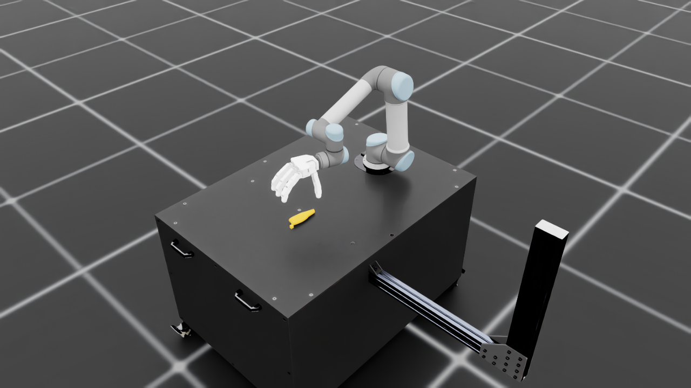

# UR5 参照 Franka Reach 的放置修正

当前 UR5 安装在黑桌的 min-X 一侧，抓取工作区朝向 +X。底座位置为 `(-0.1939, -0.75152, 0.7710023993)`，root quaternion 为 `(1, 0, 0, 0)`。底座安装面与 0.771 m 桌面齐平。

已对照用户提供的 `截图 2026-10-01 15-02-47.png`，从 +X/+Y 侧生成实际 UR5 场景截图：底座位于桌面后侧，灵巧手伸向桌面内部，桌子侧面的支架位于画面右侧。该视角仅用于验收截图。

参考：[官方 Franka Reach 机器人配置](https://github.com/isaac-sim/IsaacLab/blob/main/source/isaaclab_tasks/isaaclab_tasks/manager_based/manipulation/reach/config/franka/joint_pos_env_cfg.py)及其[共享场景](https://github.com/isaac-sim/IsaacLab/blob/main/source/isaaclab_tasks/isaaclab_tasks/manager_based/manipulation/reach/reach_env_cfg.py)。已使用本地 IsaacLab 的 FrankaReachEnvCfg 和实际桌面碰撞体测量验证相对放置关系，结果保存在 [reference.json](reference.json)。

| 测量项 | Franka Reach | 当前 UR5 场景 |
| --- | --- | --- |
| 机器人 root 相对桌面中心的 XY 偏移 / m | (-0.393899, 0.000001) | (-0.393900, 0) |
| 机器人 root 至 min-X 桌边距离 / m | 0.246111 | 0.246100 |
| root quaternion（wxyz） | (1, 0, 0, 0) | (1, 0, 0, 0) |

## 本轮代码修改

- `grasp1_env_cfg.py`：按参考的机器人与桌面相对位置设置 UR5 root pose。
- `mdp/events.py`：将原 Teacher 的物体采样位置与姿态、预抓取相机位置、固定碰撞回退位置旋转到当前工作区。去掉平台后，源工作坐标先旋转 +1.57 rad 到 base_link，再通过实际 robot root 转到世界坐标；IK 继续使用实际底座位姿。
- `config/ur5_allegro/teacher_env_cfg.py`：同步相机坐标说明。

## 实际运行验证

运行目录为 `/home/windsky/project/Grasp1`，conda 环境为 `grasp`，设备为 `cuda:0`。以下进程退出码均为 0。

| 验证 | 结果 | 证据 |
| --- | --- | --- |
| 官方相对位置测量 | REFERENCE_RELATION_PASS | [reference.log](reference.log) |
| 1 环境，100 次 reset | IK 100/100；碰撞回退 0；初始化后机械臂碰撞 0 | [single-env.json](single-env.json) |
| 4 环境，每环境 100 次 reset | IK 400/400；碰撞回退 0；初始化后机械臂碰撞 0 | [four-env.json](four-env.json) |
| 底座及物体支撑 | 底座完全位于桌面范围内；物体采样位于桌面内、机器人 +X 侧；物体最低碰撞点与桌面误差不超过 6e-8 m | 上述 JSON |
| 观测及奖励 | policy 形状为 [N,153]，动作形状为 [N,22]，零动作步的观测与奖励有限 | [single-env.log](single-env.log)、[four-env.log](four-env.log) |
| 桌面接触 | 真实物理步产生非零桌面接触和冲量奖励原始项 | 上述 JSON 中 support_contact_raw / support_impulse_raw |
| PPO 4 环境，1 次迭代 | 完成 280 个 timesteps 和参数更新，耗时约 15 秒 | [training.log](training.log) |
| 渲染 | 已检查底座贴合桌面、机械臂伸向桌面内部的实际图像 | [scene-close.png](scene-close.png) |
| 静态检查 | compileall 和 git diff --check 通过 | [compile.log](compile.log) |

训练输出位于 `logs/rsl_rl/grasp1_ur5_allegro_teacher/2026-10-01_15-09-59/`。

复现四环境 reset 验证：

```bash
env -u DISPLAY PYTHONPATH=/home/windsky/project/Grasp1/source/Grasp1 PYTHONUNBUFFERED=1 TERM=xterm \
  /home/windsky/miniconda3/bin/conda run --no-capture-output -n grasp \
  /home/windsky/IsaacLab/isaaclab.sh -p logs/acceptance/2026-10-01/reach-placement/check_reach_mount.py \
  --num_envs 4 --output logs/acceptance/2026-10-01/reach-placement/four-env.json --headless
```

复现训练验证：

```bash
env -u DISPLAY PYTHONPATH=/home/windsky/project/Grasp1/source/Grasp1 PYTHONUNBUFFERED=1 TERM=xterm \
  /home/windsky/miniconda3/bin/conda run --no-capture-output -n grasp \
  /home/windsky/IsaacLab/isaaclab.sh -p scripts/rsl_rl/train.py \
  --task Grasp1-UR5-Allegro-Teacher-v0 --num_envs 4 --max_iterations 1 --headless
```


